    

    <b>Automatic Architecture Diagrams from Code</b> 
    <a href="https://github.com/JashanMaan28/swark-continued">GitHub (Fork)</a> • <a href="https://github.com/swark-io/swark">Original Project</a>

## Usage Instructions

1. **Render the Diagram**: Use the links below to open it in Mermaid Live Editor, or install the [Mermaid Support](https://marketplace.visualstudio.com/items?itemName=bierner.markdown-mermaid) extension.
2. **Recommended Model**: If available for you, use `gemini` [language model](vscode://settings/swark-continued.languageModel). It can process more files and generates better diagrams.
3. **Iterate for Best Results**: Language models are non-deterministic. Generate the diagram multiple times and choose the best result.

## Generated Content
**Model**: GPT-4o - [Change Model](vscode://settings/swark-continued.languageModel)  
**Mermaid Live Editor**: [View](https://mermaid.live/view#pako:eNqFlsFu2zAMhl8l8Ll9gRwGpEm7DciGos5O8g6MzdrCZMmQ5LRZ0XcfrcipLUvrJTB_frZEUvqRt6xUFWbrrJC1hq5ZHXaFXK1Mf7yEW9V2SqK0ZpBXqwehwHJZ3wtsB5WFwu8L9xNfzKbjOeoTL5HNQ8_8gBr-cokfa7ClFLKgKzYNfH6voKJd5B2XEjWbh575Li1qKC0_4bYBbVkoeG6nXiRVVT1hp7TdcRCqZjFx5ME0R0V7yekjtCoLhZDbw1n1lgVxSA3VGTYPPbPtjVXtNXXXc1FR1XF5fIdaChqGYjcSxNlwwyLaSNNHaLQvD0pjCcayUPDcVwXiQD38M9Q9DXz-CUniLe7AwqNWJz7sMyZ6nsJnbvfKmNyCdUeKRbSRBmO6RoOhAyOtVoItlCupQQh4_YZasWng83nZYNUL9PM1LBQ8d2ho_YOqa4Fs8jzNXsucRdd1aE8iRzp0SrJZ5AiUVSFnN3DPj5dXN9UJZImVm5TlpWELZRyeOd2_Drtm16cxIzh1b6vPnVVsGiTGTounJn_XG7qCxgxDZNPA5zdStbStHVpfbCiMHek7ONK82Pgw3ngla8Xcr1d-WS4Mc7-JXj1CjebDgLwLOPcZHWL-Zuheq9vbL-E9Hbi5f6WopXt9SpKaYuYelqJCD0txMf9KsoF_fco5b0pRcVdK0ktLSqLBwUxxU1tKMTFLSrERP0qioR2lwQ9LSjGhJaW4iS_9F_mszpk7xaEBW7jQHHVnw41r9KJLPnIeHTUxJQcuWhgbPfmUg0N9YKfelNhaaE2Xby1PouuKtynHbHrbjG1093qwq2jG2ZbLTMZzaeDEquJdzm6yFnULvKI_am9FZocvFNl6VWQVPkMvbJG9E9R3FZ1H6iW5YZutre7xJoPeqvwsyzHWqq-bbP0MwuD7P5ECmp4) | [Edit](https://mermaid.live/edit#pako:eNqFlsFu2zAMhl8l8Ll9gRwGpEm7DciGos5O8g6MzdrCZMmQ5LRZ0XcfrcipLUvrJTB_frZEUvqRt6xUFWbrrJC1hq5ZHXaFXK1Mf7yEW9V2SqK0ZpBXqwehwHJZ3wtsB5WFwu8L9xNfzKbjOeoTL5HNQ8_8gBr-cokfa7ClFLKgKzYNfH6voKJd5B2XEjWbh575Li1qKC0_4bYBbVkoeG6nXiRVVT1hp7TdcRCqZjFx5ME0R0V7yekjtCoLhZDbw1n1lgVxSA3VGTYPPbPtjVXtNXXXc1FR1XF5fIdaChqGYjcSxNlwwyLaSNNHaLQvD0pjCcayUPDcVwXiQD38M9Q9DXz-CUniLe7AwqNWJz7sMyZ6nsJnbvfKmNyCdUeKRbSRBmO6RoOhAyOtVoItlCupQQh4_YZasWng83nZYNUL9PM1LBQ8d2ho_YOqa4Fs8jzNXsucRdd1aE8iRzp0SrJZ5AiUVSFnN3DPj5dXN9UJZImVm5TlpWELZRyeOd2_Drtm16cxIzh1b6vPnVVsGiTGTounJn_XG7qCxgxDZNPA5zdStbStHVpfbCiMHek7ONK82Pgw3ngla8Xcr1d-WS4Mc7-JXj1CjebDgLwLOPcZHWL-Zuheq9vbL-E9Hbi5f6WopXt9SpKaYuYelqJCD0txMf9KsoF_fco5b0pRcVdK0ktLSqLBwUxxU1tKMTFLSrERP0qioR2lwQ9LSjGhJaW4iS_9F_mszpk7xaEBW7jQHHVnw41r9KJLPnIeHTUxJQcuWhgbPfmUg0N9YKfelNhaaE2Xby1PouuKtynHbHrbjG1093qwq2jG2ZbLTMZzaeDEquJdzm6yFnULvKI_am9FZocvFNl6VWQVPkMvbJG9E9R3FZ1H6iW5YZutre7xJoPeqvwsyzHWqq-bbP0MwuD7P5ECmp4)

```mermaid
graph TD
  subgraph Components
    FloatingElements[FloatingElements]
    NewsApiService[NewsApiService]
    MagazineComponents[MagazineComponents]
    MagazineCard[MagazineCard]
    LoadingSpinner[LoadingSpinner]
    InteractiveChart[InteractiveChart]
    DownloadReportDialog[DownloadReportDialog]
    DashboardSharing[DashboardSharing]
    DashboardLayout[DashboardLayout]
    DashboardCards[DashboardCards]
    CustomDashboardBuilder[CustomDashboardBuilder]
    ComparativeAnalysis[ComparativeAnalysis]
    CashFlowForecast[CashFlowForecast]
    GoalTracking[GoalTracking]
    RealTimeDataProvider[RealTimeDataProvider]
    ProfitLossStatement[ProfitLossStatement]
    PassphraseControl[PassphraseControl]
    ParallaxHero[ParallaxHero]
    ScheduledReports[ScheduledReports]
    ThemeToggle[ThemeToggle]
    ThemeProvider[ThemeProvider]
    ScrollSection[ScrollSection]
  end

  subgraph Lib
    AdvancedAnalytics[AdvancedAnalytics]
    CsvExport[CsvExport]
    ClientCrypto[ClientCrypto]
    CashFlowForecastLib[CashFlowForecast]
    BusinessData[BusinessData]
    AnomalyDetection[AnomalyDetection]
    Supabase[Supabase]
    Mongo[Mongo]
    Utils[Utils]
  end

  subgraph Pages
    NewsLoading[News Loading]
  end

  FloatingElements --> DashboardLayout
  NewsApiService --> DashboardLayout
  MagazineComponents --> DashboardLayout
  MagazineCard --> DashboardLayout
  LoadingSpinner --> DashboardLayout
  InteractiveChart --> DashboardLayout
  DownloadReportDialog --> DashboardLayout
  DashboardSharing --> DashboardLayout
  DashboardCards --> DashboardLayout
  CustomDashboardBuilder --> DashboardLayout
  ComparativeAnalysis --> DashboardLayout
  CashFlowForecast --> DashboardLayout
  GoalTracking --> DashboardLayout
  RealTimeDataProvider --> DashboardLayout
  ProfitLossStatement --> DashboardLayout
  PassphraseControl --> DashboardLayout
  ParallaxHero --> DashboardLayout
  ScheduledReports --> DashboardLayout
  ThemeToggle --> DashboardLayout
  ThemeProvider --> DashboardLayout
  ScrollSection --> DashboardLayout

  AdvancedAnalytics --> DashboardCards
  CsvExport --> DownloadReportDialog
  ClientCrypto --> PassphraseControl
  CashFlowForecastLib --> CashFlowForecast
  BusinessData --> DashboardCards
  AnomalyDetection --> ComparativeAnalysis
  Supabase --> AuthProvider
  Mongo --> AuthProvider
  Utils --> ThemeToggle

  NewsLoading --> DashboardLayout
```

