    

    <b>Automatic Architecture Diagrams from Code</b> 
    <a href="https://github.com/JashanMaan28/swark-continued">GitHub (Fork)</a> • <a href="https://github.com/swark-io/swark">Original Project</a>

## Usage Instructions

1. **Render the Diagram**: Use the links below to open it in Mermaid Live Editor, or install the [Mermaid Support](https://marketplace.visualstudio.com/items?itemName=bierner.markdown-mermaid) extension.
2. **Recommended Model**: If available for you, use `gemini` [language model](vscode://settings/swark-continued.languageModel). It can process more files and generates better diagrams.
3. **Iterate for Best Results**: Language models are non-deterministic. Generate the diagram multiple times and choose the best result.

## Generated Content
**Model**: Claude Sonnet 4.6 - [Change Model](vscode://settings/swark-continued.languageModel)  
**Mermaid Live Editor**: [View](https://mermaid.live/view#pako:eNqNl8ly2zgQhl-FxXM4vvuQKi2Ooyo58ZhyLqM5QGSLwoQEOFgke1J592ls3ECprIvYja-J7W-g-SsteAnpfbpnx5pfihMRKtkt9yzBn9SHSpD2lKxqCkz9tU_dQ7IU_CJB7NO_HTiCn0kFEtlv8Kb--Ec6O7lLFm2bvHCtJnHm95U3YDCM2hJWUlbZqIjb8oqyAJpnfG1OK6bbCF0TeTpwIkqPd3ZEujlJz3krona85IGxzxHxDS4BMI9R-2KzYZJWp66rxSYJngjOcSMgjN0ZyfwUgJV7NrcNgp9pCcJsxYozhbvR--LBaXUKrWZoAzNin4mU7UkQCYOI2Bkv4QmaYcjI_tCcXjcr3rScmR3CF7xukt6-roAteUfZDTXgPFHEE6nIf5TBChHEh2bEbnBFBSkUPcPKJA3yU1e8cIIfqdpyKXNFFE7e5tSMN9YojvwL5ucXLqAg0qbixPWDwiWKe-Sk3uGYfmJKYczQvL5eRm6On7pimRYnKHUN5Qu0XNhNmbrifviF1Zz4dtPLyLGmpOZxTystFW-6AZkFGHuWmtZzqjMKIYKYXVkwUr9L6jIi8n5IgV85_ym7zp0ZdaklmARCzD_NEX3COK635-gXwJ2jDayJIo4feuYidtzpJDzOMXkheF0vGG1wJThz9MT5oWXZ0sPkjsgkZrXxyysH7kq8t4ojXzi-sHayeMizx9VTHJT_eHjzginkOQNrxIfw9k8N4h0hRpQWpM5qwiqN52j2r2mIDz7GG9z_NSgo_BoQ58rK4IuCcCTAcKV0hVebIYwkwDkz2XujwBc4A9MwSOMWT3Zqz4xMuMaryY-LaSaPVmbu6uzo33LjnHEhrbWzGh3x_MszYQWUNgsULcxMiPdlJDijsKWWeDJK6fV48GZWTtVoFTORTiebhzc8MbGPHMSZFrZqCK4k-EZvy3VLDi5lwmMSJdgj51UN330KOiv5HmPQUEYXm55xHryoR5y5zBfPG3-tJ_g4fk1DaG3eYf6T_Gn33DXPTdlUReFtrj5Cy9VF46mie8MKLIwQvSMtvaPWmjI5iq50p7WlpLen3JYTq1IL1caYEr7yCUwxUwghZWufwKioEELiVbqiwxJaTqsNJMw11BGVMaJZmYqnm5IxIiK-eRwc_JhO8f2Dgd2FYQ5QRfv1LUPDnfAtUZ-4tA9-u11n6MjAeKZoX-wFltCMTqu9OYGYjPISf-Ks4utlslA1Gc9jxeuwzHaFkwKP7JnDCrlORE4_N8iBlIKKbtBBUFZLN7heVl5RN9ggLqurG1wQkNXOrRkZ5RjQSugm6WVj4amE5uIGWzcslpMs-9ydUleaB-eTI-La2XLDezL01X0BWWJUprPos8cy06L3CjYsra8x3S1_DZiWJX7QE7cb-kwmBt59MRrKn5bO7Q0_KzVY4pAObtmC5rs2Z4bGIPNu-4bZ6jbI3wxde5f4rtkmPBt-8_nB2ouij5ocUcPg9FPagMDnEr-9f6HizbfQPr1P9mkJR6JrvNV_I6RbvFEBa2I8HJr0XgkNn1KiFc_fWRFswXV1Su-PmAzw-3-Izgie) | [Edit](https://mermaid.live/edit#pako:eNqNl8ly2zgQhl-FxXM4vvuQKi2Ooyo58ZhyLqM5QGSLwoQEOFgke1J592ls3ECprIvYja-J7W-g-SsteAnpfbpnx5pfihMRKtkt9yzBn9SHSpD2lKxqCkz9tU_dQ7IU_CJB7NO_HTiCn0kFEtlv8Kb--Ec6O7lLFm2bvHCtJnHm95U3YDCM2hJWUlbZqIjb8oqyAJpnfG1OK6bbCF0TeTpwIkqPd3ZEujlJz3krona85IGxzxHxDS4BMI9R-2KzYZJWp66rxSYJngjOcSMgjN0ZyfwUgJV7NrcNgp9pCcJsxYozhbvR--LBaXUKrWZoAzNin4mU7UkQCYOI2Bkv4QmaYcjI_tCcXjcr3rScmR3CF7xukt6-roAteUfZDTXgPFHEE6nIf5TBChHEh2bEbnBFBSkUPcPKJA3yU1e8cIIfqdpyKXNFFE7e5tSMN9YojvwL5ucXLqAg0qbixPWDwiWKe-Sk3uGYfmJKYczQvL5eRm6On7pimRYnKHUN5Qu0XNhNmbrifviF1Zz4dtPLyLGmpOZxTystFW-6AZkFGHuWmtZzqjMKIYKYXVkwUr9L6jIi8n5IgV85_ym7zp0ZdaklmARCzD_NEX3COK635-gXwJ2jDayJIo4feuYidtzpJDzOMXkheF0vGG1wJThz9MT5oWXZ0sPkjsgkZrXxyysH7kq8t4ojXzi-sHayeMizx9VTHJT_eHjzginkOQNrxIfw9k8N4h0hRpQWpM5qwiqN52j2r2mIDz7GG9z_NSgo_BoQ58rK4IuCcCTAcKV0hVebIYwkwDkz2XujwBc4A9MwSOMWT3Zqz4xMuMaryY-LaSaPVmbu6uzo33LjnHEhrbWzGh3x_MszYQWUNgsULcxMiPdlJDijsKWWeDJK6fV48GZWTtVoFTORTiebhzc8MbGPHMSZFrZqCK4k-EZvy3VLDi5lwmMSJdgj51UN330KOiv5HmPQUEYXm55xHryoR5y5zBfPG3-tJ_g4fk1DaG3eYf6T_Gn33DXPTdlUReFtrj5Cy9VF46mie8MKLIwQvSMtvaPWmjI5iq50p7WlpLen3JYTq1IL1caYEr7yCUwxUwghZWufwKioEELiVbqiwxJaTqsNJMw11BGVMaJZmYqnm5IxIiK-eRwc_JhO8f2Dgd2FYQ5QRfv1LUPDnfAtUZ-4tA9-u11n6MjAeKZoX-wFltCMTqu9OYGYjPISf-Ks4utlslA1Gc9jxeuwzHaFkwKP7JnDCrlORE4_N8iBlIKKbtBBUFZLN7heVl5RN9ggLqurG1wQkNXOrRkZ5RjQSugm6WVj4amE5uIGWzcslpMs-9ydUleaB-eTI-La2XLDezL01X0BWWJUprPos8cy06L3CjYsra8x3S1_DZiWJX7QE7cb-kwmBt59MRrKn5bO7Q0_KzVY4pAObtmC5rs2Z4bGIPNu-4bZ6jbI3wxde5f4rtkmPBt-8_nB2ouij5ocUcPg9FPagMDnEr-9f6HizbfQPr1P9mkJR6JrvNV_I6RbvFEBa2I8HJr0XgkNn1KiFc_fWRFswXV1Su-PmAzw-3-Izgie)

```mermaid
flowchart TB
    subgraph Client["Client Browser"]
        subgraph Pages["Next.js Pages / App Router"]
            HomePage["Landing Page"]
            LoginPage["Login / Signup"]
            DashboardPage["Dashboard"]
            ClientsPage["Clients"]
            TodosPage["Todos"]
            NewsPage["News"]
            AIInsightsPage["AI Insights"]
            SharedPage["Shared Dashboard"]
        end

        subgraph Providers["Context Providers"]
            AuthProvider["AuthProvider"]
            PassphraseProvider["PassphraseProvider"]
            ThemeProvider["ThemeProvider"]
        end

        subgraph UIComponents["UI Components"]
            DashboardLayout["DashboardLayout"]
            MagazineCard["MagazineCard"]
            InteractiveChart["InteractiveChart"]
            ProfitLossStatement["ProfitLossStatement"]
            CashFlowForecast["CashFlowForecastView"]
            GoalTracking["GoalTracking"]
            DashboardSharing["DashboardSharing"]
            ScheduledReports["ScheduledReports"]
            DownloadReport["DownloadReportDialog"]
            CustomDashboard["CustomDashboardBuilder"]
            ComparativeAnalysis["ComparativeAnalysis"]
        end

        subgraph Hooks["Custom Hooks"]
            useAuth["useAuth"]
            usePassphrase["usePassphrase"]
            useRealTimeData["useRealTimeData"]
            useToast["useToast"]
            useScrollAnimation["useScrollAnimation"]
        end

        subgraph LibClient["Client-side Libs"]
            ClientCrypto["client-crypto AES-GCM"]
            CSVExport["csv-export"]
            NLQuery["natural-language-query"]
            AnomalyDetection["anomaly-detection"]
            ExpenseSuggestions["expense-suggestions"]
            RevenueForecast["predictive-revenue"]
            CashFlowLib["cash-flow-forecast"]
            ProfitLossLib["profit-loss"]
            AdvancedAnalytics["advanced-analytics"]
            BusinessData["business-data"]
        end
    end

    subgraph ExternalServices["External Services"]
        Supabase["Supabase Auth"]
        GoogleOAuth["Google OAuth"]
        GeminiAI["Google Gemini AI"]
        NewsAPI["News API"]
        Gmail["Gmail SMTP"]
    end

    subgraph NextAPI["Next.js API Routes"]
        APIIncome["/api/income"]
        APISpending["/api/spending"]
        APILoans["/api/loans"]
        APIClients["/api/clients"]
        APITodos["/api/todos"]
        APIUsers["/api/users"]
        APIGoals["/api/goals"]
        APIShare["/api/share"]
        APIScheduledReports["/api/scheduled-reports"]
        APIDashboardRealtime["/api/dashboard/realtime"]
        APISendEmail["/api/send-email"]
        APIAIInsights["/api/ai-insights"]
    end

    subgraph Database["MongoDB Atlas"]
        ColUsers["users collection"]
        ColIncome["income collection"]
        ColSpending["spending collection"]
        ColLoans["loans collection"]
        ColClients["clients collection"]
        ColTodos["todos collection"]
        ColGoals["goals collection"]
        ColShares["shares collection"]
        ColSchedules["scheduled-reports collection"]
    end

    AuthProvider --> Supabase
    AuthProvider --> GoogleOAuth
    PassphraseProvider --> ClientCrypto

    LoginPage --> AuthProvider
    DashboardPage --> DashboardLayout
    DashboardPage --> UIComponents
    DashboardPage --> LibClient
    DashboardPage --> useRealTimeData

    useRealTimeData --> APIDashboardRealtime

    Pages --> NextAPI
    NextAPI --> Database
    ColUsers --> ColIncome
    ColIncome --> ColSpending

    APIAIInsights --> GeminiAI
    APISendEmail --> Gmail
    NewsPage --> NewsAPI
    APIScheduledReports --> Gmail
```

