    

    <b>Automatic Architecture Diagrams from Code</b> 
    <a href="https://github.com/JashanMaan28/swark-continued">GitHub (Fork)</a> • <a href="https://github.com/swark-io/swark">Original Project</a>

## Usage Instructions

1. **Render the Diagram**: Use the links below to open it in Mermaid Live Editor, or install the [Mermaid Support](https://marketplace.visualstudio.com/items?itemName=bierner.markdown-mermaid) extension.
2. **Recommended Model**: If available for you, use `gemini` [language model](vscode://settings/swark-continued.languageModel). It can process more files and generates better diagrams.
3. **Iterate for Best Results**: Language models are non-deterministic. Generate the diagram multiple times and choose the best result.

## Generated Content
**Model**: Claude Sonnet 4.6 - [Change Model](vscode://settings/swark-continued.languageModel)  
**Mermaid Live Editor**: [View](https://mermaid.live/view#pako:eNqNV0tz2zYQ_iscnsP67kNnaElOOKNkXEvupeoBJmEKCQWwACjLzeS_dxcgQBKAVesi7O63eOybP_NaNDS_zQ_8pROv9ZFIne3XB57BTw3PrST9MVt1jHL91yG3i6zIvtGL_u27ysq-P-R_W_hC5YG0VIGG-V9A8PdFnChKAIDL7CbbEt4w3kbIrWgZH6FmDdgda_nQR9A1UcdnQWQzwj0dIcuq4oq1R61GaFlljhOB7ZsdcqQi1F40wmHMOkJ8o68OgMtIvgPbU3d3S2TpJ1DeHHjC5k_VSpx6wfGCsMdTlU30-9bakjcx6Lm9LCfS-Epa8i_jdAUQgM_JCHvfCaLBn5uOnsbrhKxIp-KaSlJrdqYrjEPQCVmxc-CBRBIElJx0b4rhUQlurDkoLU7-zai15NwNrGuojBQ_C9Lt4VI_4C2gNScj7MN2p4k278VckOKF6a1QynPja8HxYKnXeyFpTZRJuoD1visxauytQlYcbfWRNkNHm0faC2kcFLIinUdKOs0gc6U4MzAN6CBrD6w10cSx4_uJVw7OH_fF2y0Ya0Y60SbzZUflmdUuZcqejYwPpYO7j40IiKSLnnhxTRj0cfawOQn17p5J-kwUjT1MlOqPEkQrfTH1ztPjkUW24bV86zUTPC4bR7qw54L-0CttQdqyZzXVZ6AkuD1ReMvmTHhNG5MWmtWoREZeQRwzVuPiBLI11bTGd6CWZRWN40VKm0tPuaK7oYUWgAg8jFpmoSZu7PntHwOVb4DmRA-SdEVHeDtAZSz-QUHsBKiVzFSJR3qmfMCA6T2vkJYZ59ruT7ijDclanQtqiHcawApdKBBpyMK4VIB3y80uLpWCtwK8APATLgG2vstqwXnCVsazgYu9e8uHCqPxocoeoSZTNfXexR4AqHgNrRTAN6RnN8xQIWYHxm9shTAoNdIhbiuI8ZYBdUiEiLEPOkydaIuAMp3QYXTUFgHxpGyCGsSgwswEBBZYj2iRiF6FzdI_CYkQUVbQPrSDEFbAoKMj0DzIPfZqmIPWIvac1v8EH6i5Wuo0Glewb-QoiV4JrtqcCOv8S4FRUOSkzP5IT4zbouKtD5exzGjvuBvYIxwfNOOegGEgBQ90amDZu4U6qfjeXKDDQ90ZCzvu4liZ4y0OdZUYJ4pxaWr3AmTyb32HU4pdZaXuyHKjz2gLVlamh4u2oyMHpsMlbrS5-c92X_cPmIMwNSMdmNJ0KZOxd4OC2Ugpw0JLpaxghuOsKH5fjG6hbOpZgWAq_VYy3yTUtIjFiGwgvnBcAbiqcQViCsYVuRub30eYQnBF7hLGPWU5wzuUTfSriHmWXwMuEvsacG6_NGJpwDRmZsE0wJvQgmafJUkj-w8SJ7VfJXz-KWJEsznLSqcPEX9_U1PDGBpHywCUGi49JJwweThQO6Qp-t7VzsZGOma0FznjJoXGqknJaKykzJgqKTFRmpSYG6cviIZJS1J2CkEu8NOvmOrvUu4RNiOM0FW86XzXUqzYtBKe6CEfOnq-nz9_MUUDyM_RPBqeZyXNzlpTrI7h6cMVyynPP-UnKuG0Jr_Nfx5yjaPzIb_NDnlDX8jQQYP_BaChb-BjCz4yoOGc8lstB_opJ4MWuzdeO1qKoT3mty_gQ_rrPx0dYZE) | [Edit](https://mermaid.live/edit#pako:eNqNV0tz2zYQ_iscnsP67kNnaElOOKNkXEvupeoBJmEKCQWwACjLzeS_dxcgQBKAVesi7O63eOybP_NaNDS_zQ_8pROv9ZFIne3XB57BTw3PrST9MVt1jHL91yG3i6zIvtGL_u27ysq-P-R_W_hC5YG0VIGG-V9A8PdFnChKAIDL7CbbEt4w3kbIrWgZH6FmDdgda_nQR9A1UcdnQWQzwj0dIcuq4oq1R61GaFlljhOB7ZsdcqQi1F40wmHMOkJ8o68OgMtIvgPbU3d3S2TpJ1DeHHjC5k_VSpx6wfGCsMdTlU30-9bakjcx6Lm9LCfS-Epa8i_jdAUQgM_JCHvfCaLBn5uOnsbrhKxIp-KaSlJrdqYrjEPQCVmxc-CBRBIElJx0b4rhUQlurDkoLU7-zai15NwNrGuojBQ_C9Lt4VI_4C2gNScj7MN2p4k278VckOKF6a1QynPja8HxYKnXeyFpTZRJuoD1visxauytQlYcbfWRNkNHm0faC2kcFLIinUdKOs0gc6U4MzAN6CBrD6w10cSx4_uJVw7OH_fF2y0Ya0Y60SbzZUflmdUuZcqejYwPpYO7j40IiKSLnnhxTRj0cfawOQn17p5J-kwUjT1MlOqPEkQrfTH1ztPjkUW24bV86zUTPC4bR7qw54L-0CttQdqyZzXVZ6AkuD1ReMvmTHhNG5MWmtWoREZeQRwzVuPiBLI11bTGd6CWZRWN40VKm0tPuaK7oYUWgAg8jFpmoSZu7PntHwOVb4DmRA-SdEVHeDtAZSz-QUHsBKiVzFSJR3qmfMCA6T2vkJYZ59ruT7ijDclanQtqiHcawApdKBBpyMK4VIB3y80uLpWCtwK8APATLgG2vstqwXnCVsazgYu9e8uHCqPxocoeoSZTNfXexR4AqHgNrRTAN6RnN8xQIWYHxm9shTAoNdIhbiuI8ZYBdUiEiLEPOkydaIuAMp3QYXTUFgHxpGyCGsSgwswEBBZYj2iRiF6FzdI_CYkQUVbQPrSDEFbAoKMj0DzIPfZqmIPWIvac1v8EH6i5Wuo0Glewb-QoiV4JrtqcCOv8S4FRUOSkzP5IT4zbouKtD5exzGjvuBvYIxwfNOOegGEgBQ90amDZu4U6qfjeXKDDQ90ZCzvu4liZ4y0OdZUYJ4pxaWr3AmTyb32HU4pdZaXuyHKjz2gLVlamh4u2oyMHpsMlbrS5-c92X_cPmIMwNSMdmNJ0KZOxd4OC2Ugpw0JLpaxghuOsKH5fjG6hbOpZgWAq_VYy3yTUtIjFiGwgvnBcAbiqcQViCsYVuRub30eYQnBF7hLGPWU5wzuUTfSriHmWXwMuEvsacG6_NGJpwDRmZsE0wJvQgmafJUkj-w8SJ7VfJXz-KWJEsznLSqcPEX9_U1PDGBpHywCUGi49JJwweThQO6Qp-t7VzsZGOma0FznjJoXGqknJaKykzJgqKTFRmpSYG6cviIZJS1J2CkEu8NOvmOrvUu4RNiOM0FW86XzXUqzYtBKe6CEfOnq-nz9_MUUDyM_RPBqeZyXNzlpTrI7h6cMVyynPP-UnKuG0Jr_Nfx5yjaPzIb_NDnlDX8jQQYP_BaChb-BjCz4yoOGc8lstB_opJ4MWuzdeO1qKoT3mty_gQ_rrPx0dYZE)

```mermaid
flowchart TD
    subgraph Client["Client - Next.js App"]
        subgraph Pages["Pages"]
            HomePage["Home / Landing"]
            LoginPage["Login / Signup"]
            DashboardPage["Dashboard"]
            AIInsightsPage["AI Insights"]
            ClientsPage["Clients"]
            TodosPage["Todos"]
            NewsPage["News"]
            SharedPage["Shared Dashboard"]
        end

        subgraph UIComponents["UI Components"]
            DashboardLayout["DashboardLayout"]
            MagazineCard["MagazineCard"]
            FloatingElements["FloatingElements"]
            InteractiveChart["InteractiveChart"]
            ComparativeAnalysis["ComparativeAnalysis"]
            CustomDashboard["CustomDashboardBuilder"]
            GoalTracking["GoalTracking"]
            PLStatement["ProfitLossStatement"]
            CashFlowForecast["CashFlowForecast"]
            DashboardSharing["DashboardSharing"]
            ScheduledReports["ScheduledReports"]
            RealtimeProvider["RealTimeDataProvider"]
            DownloadReport["DownloadReportDialog"]
            NewsService["NewsApiService"]
        end

        subgraph Providers["Context Providers"]
            AuthProvider["AuthProvider - Firebase"]
            PassphraseCtx["PassphraseContext - Encryption"]
            ThemeProvider["ThemeProvider"]
        end

        subgraph ClientLibs["Client Libraries"]
            AdvancedAnalytics["advanced-analytics"]
            AnomalyDetection["anomaly-detection"]
            ExpenseSuggestions["expense-suggestions"]
            NLQuery["natural-language-query"]
            PredictiveRevenue["predictive-revenue"]
            CSVExport["csv-export"]
            ClientCrypto["client-crypto - AES"]
            MongoLib["mongo - DB connection"]
        end
    end

    subgraph API["API Routes - Next.js"]
        APIIncome["/api/income"]
        APISpending["/api/spending"]
        APILoans["/api/loans"]
        APIClients["/api/clients"]
        APITodos["/api/todos"]
        APIUsers["/api/users"]
        APIGoals["/api/goals"]
        APIShare["/api/share"]
        APIAIChat["/api/ai-chat"]
        APIAnomalyDetect["/api/anomaly-detection"]
        APIPredictiveRev["/api/predictive-revenue"]
        APIRealtime["/api/dashboard/realtime"]
        APISendEmail["/api/send-email"]
        APITodoReminder["/api/todo-reminder"]
        APIScheduledReports["/api/scheduled-reports"]
        APICronReports["/api/cron/send-reports"]
    end

    subgraph ExternalServices["External Services"]
        Firebase["Firebase Auth"]
        MongoDB["MongoDB Atlas"]
        GeminiAI["Google Gemini AI"]
        Gmail["Gmail SMTP - Nodemailer"]
        NewsAPI["Business News API"]
    end

    Pages --> UIComponents
    Pages --> Providers
    Pages --> ClientLibs
    UIComponents --> Providers

    DashboardPage --> APIIncome
    DashboardPage --> APISpending
    DashboardPage --> APILoans
    DashboardPage --> APIClients
    DashboardPage --> APIUsers
    DashboardPage --> APIRealtime

    AIInsightsPage --> APIAIChat
    AIInsightsPage --> APIAnomalyDetect
    AIInsightsPage --> APIPredictiveRev
    AIInsightsPage --> APIIncome
    AIInsightsPage --> APISpending
    AIInsightsPage --> APILoans
    AIInsightsPage --> APIClients

    ClientsPage --> APIClients
    TodosPage --> APITodos
    NewsPage --> NewsService
    SharedPage --> APIShare

    DashboardSharing --> APIShare
    ScheduledReports --> APIScheduledReports
    GoalTracking --> APIGoals

    APIIncome --> MongoDB
    APISpending --> MongoDB
    APILoans --> MongoDB
    APIClients --> MongoDB
    APITodos --> MongoDB
    APIUsers --> MongoDB
    APIGoals --> MongoDB
    APIShare --> MongoDB
    APIScheduledReports --> MongoDB
    APIRealtime --> MongoDB
    APICronReports --> MongoDB

    APIAIChat --> GeminiAI
    APISendEmail --> Gmail
    APITodoReminder --> MongoDB
    APICronReports --> APISendEmail

    AuthProvider --> Firebase
    PassphraseCtx --> ClientCrypto
    NewsService --> NewsAPI
```

